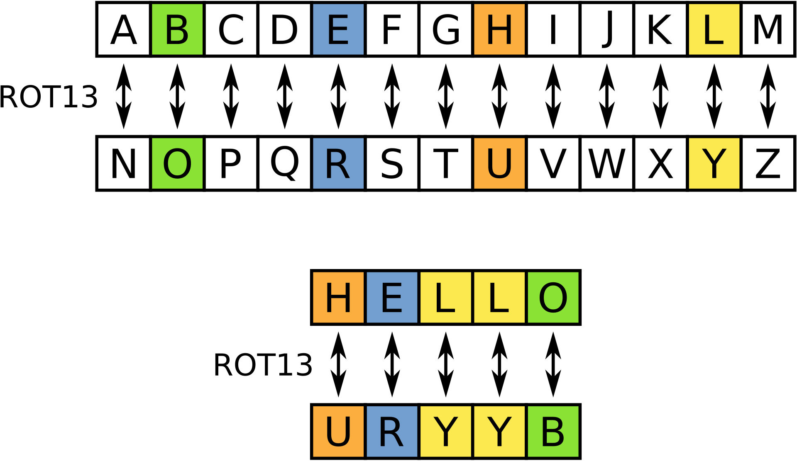

# 📓 Day 4

**Focus: Bandit 11 - 13** 
🔗 **Learning Links:**
- 🎮 [OverTheWire Bandit](https://overthewire.org/wargames/bandit/)
- 📚[Base64](https://en.wikipedia.org/wiki/Base64)
- 📚[ROT13](https://en.wikipedia.org/wiki/ROT13)
## Tasks
- [x] Task 11 ✅ 2025-09-11
	- [x] Decoding the `base64` encoded data to get the password ✅ 2025-09-11
	- [x] `base64 -d <filename>` ✅ 2025-09-11
- [x] Task 12 ✅ 2025-09-11
	- [x] Understand what is `ROT13` ✅ 2025-09-11
	- [x] Using the translate `tr` command to convert the `ROT13` text back to normal ✅ 2025-09-11
	- [x] `cat data.txt | tr 'A-Za-z' 'N-ZA-Mn-za-m' ✅ 2025-09-11

- [x] Task 13 ✅ 2025-09-12
	- [ ] 
	- [ ] 

## Findings
- Command(s): 
  
| Command                                         | Description                                                                                                        | Category |
| ----------------------------------------------- | ------------------------------------------------------------------------------------------------------------------ | -------- |
| `cp <filename1> <filename2>`                    | `cp` stands for "copy". The first argument is the source file, the second is the destination                       | Linux    |
| `mv <filename> .. `                             | `mv` stands for "move". The `..` represents the parent directory (one level up).                                   | Linux    |
| `rm <filename>`                                 | `rm` stands for "remove". Be careful with this command                                                             | Linux    |
| `ls ..`                                         | List the contents of previous directory                                                                            | Linux    |
| `CTRL+L`                                        | To clear the screen/terminal                                                                                       | Linux    |
| `man <command>`                                 | Detailed information, use the `man` command (short for "manual"                                                    | Linux    |
| `<command> --help`                              | Summary of a command and its options, use the `--help` option                                                      | Linux    |
| `du -h <file>`                                  | How much space files/folders use                                                                                   | Linux    |
| `cat ./-`                                       | To open the dashed file                                                                                            | Linux    |
| `touch <filename>`                              | To create a file                                                                                                   | Linux    |
| `echo <text> > <filename> `                     | To append the file with the input text where `echo` can be used for multiple things too read the `man echo` for it | Linux    |
| `cat data.txt <pipe> tr 'A-Za-z 'N-ZA-Mn-za-m'` | To translate the `ROT13` file into the normal text                                                                 | Linux    |
| `base64 -d <textfile>`                          | Used to decode the `base64` encoded text                                                                           | Linux    |

## Reflections

- What I learned today:

```bash
 cp <source/file> <destination/file>
 mv <filename> ..
 rm <filename>
 ls ..
 CTRL + L or clear
 man <cmd>
 <cmd> --help
 du -h <file>
 touch <filename>
 cat ./-
 echo <"text"> > <filename>
 base64 -d <filename>
 
```

- What needs review:

>[!Info] Wild Cards
>Wildcards are special characters that help you work with multiple files at once. They're like search patterns for file names. Wildcards are powerful tools for working with groups of files. The most common wildcards are:
>
> - `*`: Matches any number of characters
> - `?`: Matches any single character
> - `[abc]`: Matches any one character listed in the brackets
>```bash
>1. touch note_{1..5}.txt #creating these five files at once
>2. ls *.txt #Listing all the txt files in the directory
>3. ls note* #Listing all the files having name note at their begining
>4. touch file1.txt file2.txt file3.txt #creating all these files at once
>```

>[!Read] Base64
**Base64** is a binary-to-text encoding scheme. It can often be recognised by equal signs at the end of the data which can be further studied from the wiki link [Base64](https://en.wikipedia.org/wiki/Base64)
>```bash
>bandit10@bandit:~$ cat data.txt
VGhlIHBhc3N3b3JkIGlzIElGdWt3S0dzRlc4TU9xM0lSRnFyeEUxaHhUTkViVVBSCg==
bandit10@bandit:~$ base64 -d data.txt
The password is IFukwKGsFW8MOq3IRFqrxE1hxTNEbUPR
>```
>

>[!Read] ROT13
> ROT13 is a simple substitution cipher that shifts each letter **13 places forward in the alphabet**, wrapping around at Z. [ROT13](https://en.wikipedia.org/wiki/ROT13)
> 

[Cheatsheet-Linux](Cheatsheet-Linux.md) 🔗
[Cheatsheet-SSH](Cheatsheet-SSH.md)🔗
[Cheatsheet-Global](Cheatsheet-Global.md)🔗